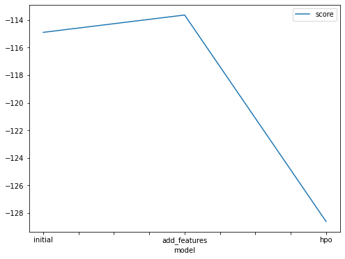
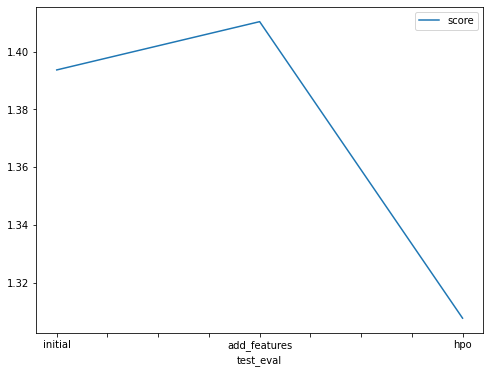

# Report: Predict Bike Sharing Demand with AutoGluon Solution
#### Kory Callanan

## Initial Training
### What did you realize when you tried to submit your predictions? What changes were needed to the output of the predictor to submit your results?
I need to zero out all the negative results before submission.

### What was the top ranked model that performed?
WeightedEnsemble_L3.

## Exploratory data analysis and feature creation
### What did the exploratory analysis find and how did you add additional features?
Using the histogram I observed that season and weather data behave relatively stable, I converted them as categorical data and add day/month/year instead.

### How much better did your model preform after adding additional features and why do you think that is?
score_val has been improved by 1.2 because when season only be seen as one feature the model didn't see as much differences as when it is splited into day/month/year.

## Hyper parameter tuning
### How much better did your model preform after trying different hyper parameters?
Overall score increased by 0.1

### If you were given more time with this dataset, where do you think you would spend more time?
I would spend more time on feature selection

### Create a table with the models you ran, the hyperparameters modified, and the kaggle score.
|model|hpo1|hpo2|hpo3|score|
|--|--|--|--|--|
|initial|600|default|default|1.39364|
|add_features|900|default|default|1.41036|
|hpo|1200|multimodal|bayesopt|1.30766|

### Create a line plot showing the top model score for the three (or more) training runs during the project.

updated img to folder

### Create a line plot showing the top kaggle score for the three (or more) prediction submissions during the project.

updated img to folder

## Summary
First time ever train and deploy models from cloud server and participate in Kaggle. It takes some time to figure out how things work especially when I have to switch from the course classroom to my own AWS env. The exploration of model comparison is fantastic. I was amazed how much improvement could be made by adding features and using different hyper-parameters.
